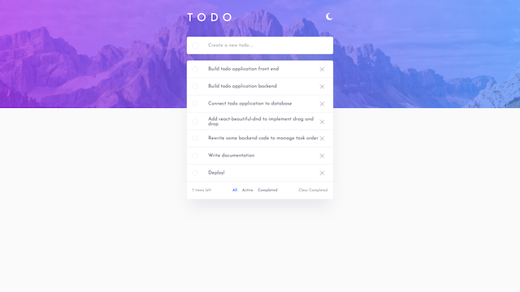

# Frontend Mentor - Todo app solution

This is a solution to the [Todo app challenge on Frontend Mentor](https://www.frontendmentor.io/challenges/todo-app-Su1_KokOW). Frontend Mentor challenges help you improve your coding skills by building realistic projects.

## Table of contents

- [Overview](#overview)
  - [The challenge](#the-challenge)
  - [Screenshot](#screenshot)
  - [Links](#links)
- [My process](#my-process)
  - [Built with](#built-with)
  - [What I learned](#what-i-learned)
  - [Continued development](#continued-development)
  - [Useful resources](#useful-resources)
- [Author](#author)
- [Acknowledgments](#acknowledgments)

**Note: Delete this note and update the table of contents based on what sections you keep.**

## Overview

### The challenge

Users should be able to:

- View the optimal layout for the app depending on their device's screen size
- See hover states for all interactive elements on the page
- Add new todos to the list
- Mark todos as complete
- Delete todos from the list
- Filter by all/active/complete todos
- Clear all completed todos
- Toggle light and dark mode
- **Bonus**: Drag and drop to reorder items on the list

### Screenshot

### Links

- [Live](https://stark-oasis-69277.herokuapp.com/)
- [Repo (frontend)](https://github.com/dorian-edwards/dnd-todo-front)
- [Repo (backend)](https://github.com/dorian-edwards/dnd-todo-back)
- [Solution]()

## My process

### Built with

- Semantic HTML5 markup
- Flexbox
- Grid
- Mobile-first workflow
- [TypeScript](https://www.typescriptlang.org/)
- [Tailwindcss](https://tailwindcss.com/)
- [React](https://reactjs.org/)
- [react-beautiful-dnd](https://github.com/atlassian/react-beautiful-dnd)
- [react-dnd](https://github.com/react-dnd/react-dnd)
- [Heroku](https://www.heroku.com)
- [MongoDB Atlas](https://www.mongodb.com/atlas/database)
- [Mongoose](https://mongoosejs.com/docs/)

### What I learned

For the front end, this was my first time implementing a dark mode. Tailwindcss made this extremely easy. Since this app was dealing with data manipulation, it was a deeper dive into Typescript interfaces and types since I had to pass around props and manipulate data structures e.g. task items.

The most challenging part of this entire project was implementing the drag and drop feature which [react-beautiful-dnd](https://github.com/atlassian/react-beautiful-dnd) made extremely easy. The learning curve was a bit steep but I got the hang of it and will be using it again in a more rigorous project later on.

What was even tricker was keeping track of the list order with the backend. For this I kept a master list of the order as a separate document in Atlas. I also had to write an endpoint for switching task orders to make sure the order remained the same on refresh.

I also tried to make accessibility more of a priority in this build by writing semantic HTML and incorporating [ARIA Landmarks](https://accessibility.oit.ncsu.edu/using-aria-landmarks-a-demonstration/). I'll admit this isn't my strong point at the moment but as I become more comfortable just making things work, I'll get better.

### Continued development

Going forward I'll continue to make accessibility more of a priority building it in from the ground up rather than backtracking and trying to tack it on at the end.

For the next backend I'll keep in mind to build it out using the MVC architecture.

A larger project on [frontendmentor](https://www.frontendmentor.io/challenges) calls for the moving of tasks between columns in addition to reordering. This will the next challenge

### Useful resources

- [react-dnd](https://github.com/react-dnd/react-dnd)
- [react-beautiful-dnd](https://github.com/atlassian/react-beautiful-dnd)
- [A free course on using react-beautiful-dnd](https://egghead.io/courses/beautiful-and-accessible-drag-and-drop-with-react-beautiful-dnd)
- [TypeScript](https://www.typescriptlang.org/)
- [Tailwindcss](https://tailwindcss.com/)
- [React](https://reactjs.org/)
- [mongoose](https://mongoosejs.com/docs/)
- [fullstackopen's](https://fullstackopen.com/en/) section on [deploying a fullstack app](https://fullstackopen.com/en/part3/deploying_app_to_internet)

## Author

- Website - [dorianedwards.dev](https://dorianedwards.dev)
- Frontend Mentor - [@dorian-edwards](https://www.frontendmentor.io/profile/dorian-edwards)
- Twitter - [@dorian_dev](https://twitter.com/dorian_dev)
- LinkedIn - [dorian-edwards](https://www.linkedin.com/in/dorian-edwards/)
